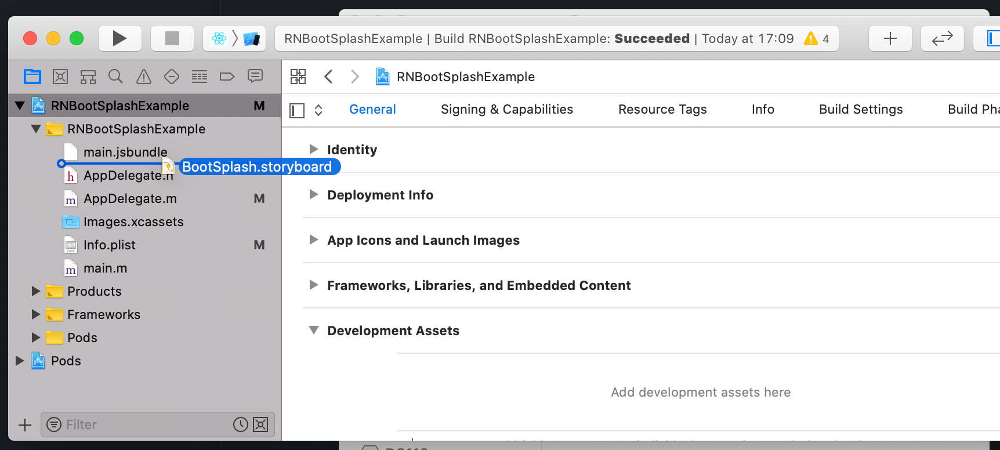
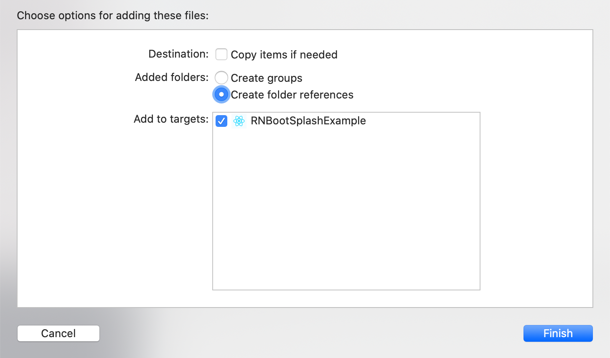
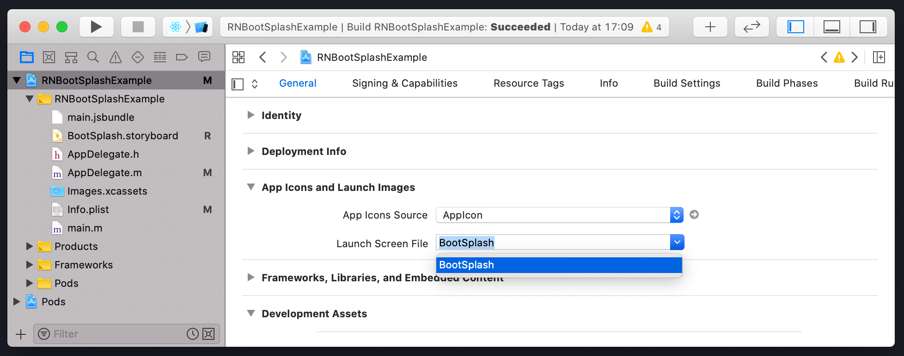

# React Native Splash Screen

- [React Native Splash Screen](#react-native-splash-screen)
- [What is a Splash Screen?](#what-is-a-splash-screen)
  - [Installation](#installation)
  - [Support](#support)
  - [Setup](#setup)
    - [Assets generation](#assets-generation)
    - [iOS](#ios)
    - [Android](#android)
  - [API](#api)
    - [**Normal Usage**](#normal-usage)
    - [**Using React Navigation**](#using-react-navigation)
    - [**Using React Navigation and Lottie Animation**](#using-react-navigation-and-lottie-animation)

# What is a Splash Screen?

A splash screen is a graphical control element consisting of a window containing an image, a logo, and the current version of the software. A splash screen can appear while a program is launching.

## Installation

To add splash screen to our app we will use a package called `react-native-bootsplash`. To install the package run the following command.

## Support

| Version | React-Native Version |
| ------- | -------------------- |
| 4.0.0+  | 0.65.0+              |
| 3.0.0+  | 0.63.0+              |

```bash
$ npm install react-native-bootsplash
# --- or ---
$ yarn add react-native-bootsplash
```

> Don't forget going into the `ios` directory to execute a `pod install`.

> Because this package targets React Native 0.65.0+, you probably don't need to link it manually.

## Setup

### Assets generation

In order to speed up the setup, react-native-bootsplash provide a CLI to generate assets, create the Android Drawable XML file and the iOS Storyboard file automatically.

To get help run the following command:

```
$ npx react-native generate-bootsplash --help
--- or ---
$ yarn react-native generate-bootsplash --help
```

To generate assets run the command:

```
npx react-native generate-bootsplash <Your Logo Path>
--- or ---
yarn react-native generate-bootsplash <Your Logo Path>

Options:
  --background-color <color>  color used as launch screen background (in hexadecimal format) (default: "#fff")
  --logo-width <width>        logo width at @1x (in dp - we recommend approximately ~100) (default: 100)
  --assets-path [path]        path to your static assets directory (useful to require the logo file in JS)
  --flavor <flavor>           [android only] flavor build variant (outputs in an android resource directory other than "main")
```

### iOS

Edit the `ios/YourProjectName/AppDelegate.m(m)` file:

```obj-c
#import "AppDelegate.h"
#import "RNBootSplash.h" // <- add the header import


@implementation AppDelegate

- (BOOL)application:(UIApplication *)application didFinishLaunchingWithOptions:(NSDictionary *)launchOptions
{
  // …

  rootViewController.view = rootView;
  self.window.rootViewController = rootViewController;
  [self.window makeKeyAndVisible];

  [RNBootSplash initWithStoryboard:@"BootSplash" rootView:rootView]; // <- initialization using the storyboard file name

  return YES;
}
```

Set the `BootSplash.storyboard` as launch screen file:

| Drag and drop the file               | Create folder reference               | Set as Launch Screen File             |
| ------------------------------------ | ------------------------------------- | ------------------------------------- |
|  | ) | ) |

### Android

On Android 12, the splash screen will not appear if you start your app from the terminal / Android Studio. To see it, kill your app and restart it in normal conditions (tap on your app icon in the app launcher).

---

1. As this library only support Android 6+, you probably have to edit your `android/build.gradle` file:

```gradle
buildscript {
  ext {
    buildToolsVersion = "31.0.0"
    minSdkVersion = 23 // <- AndroidX splashscreen has basic support for 21 (only the background color), so 23 is best
    compileSdkVersion = 31 // <- set at least 31
    targetSdkVersion = 31 // <- set at least 31

    // …
```

2. Then edit your `android/app/build.gradle` file:

```gradle
dependencies {
  // …

  implementation "androidx.swiperefreshlayout:swiperefreshlayout:1.0.0"
  implementation "androidx.core:core-splashscreen:1.0.0" // Add this line

  // …
```

3. Edit your `android/app/src/main/res/values/styles.xml` file:

```xml
<resources>

  <style name="AppTheme" parent="Theme.AppCompat.DayNight.NoActionBar">
      <!-- Your base theme customization -->
  </style>

  <!-- BootTheme should inherit from Theme.SplashScreen -->
  <style name="BootTheme" parent="Theme.SplashScreen">
    <item name="windowSplashScreenBackground">@color/bootsplash_background</item>
    <item name="windowSplashScreenAnimatedIcon">@mipmap/bootsplash_logo</item>
    <item name="postSplashScreenTheme">@style/AppTheme</item>
  </style>

</resources>
```

4. Edit your `android/app/src/main/AndroidManifest.xml` file:

```xml
<manifest xmlns:android="http://schemas.android.com/apk/res/android"
  package="com.rnbootsplashexample">

  <!-- … -->

  <application
    android:name=".MainApplication"
    android:label="@string/app_name"
    android:icon="@mipmap/ic_launcher"
    android:roundIcon="@mipmap/ic_launcher_round"
    android:allowBackup="false"
    android:theme="@style/BootTheme"> <!-- Replace @style/AppTheme with @style/BootTheme -->
    <!-- … -->
  </application>
</manifest>

```

5. Finally edit your `android/app/src/main/java/com/yourprojectname/MainActivity.java` file:

```java
// …

// Add these required imports:
import android.os.Bundle;
import com.zoontek.rnbootsplash.RNBootSplash;

public class MainActivity extends ReactActivity {

  // …

  @Override
  protected void onCreate(Bundle savedInstanceState) {
    RNBootSplash.init(this); // <- initialize the splash screen
    super.onCreate(savedInstanceState); // or super.onCreate(null) with react-native-screens
  }
}
```

## API

### **Normal Usage**

```js
import React, { useEffect } from 'react';
import RNBootSplash from 'react-native-bootsplash';

// Your Screens
import HomeScreen from './src/screens/HomeScreen';

const  App() = () =>  {
  useEffect(() => {
    const id = setTimeout(() => {
      await RNBootSplash.hide({ fade: true });
    }, 200) // You can pass any duration you want

    return () => clearTimeout(id) // Memory clean-up
  }, []);

  return <HomeScreen />
}
```

### **Using React Navigation**

If you are using React Navigation, you can hide the splash screen once the navigation container and all children have finished mounting by using the `onReady` method provided by `NavigationContainer`.

```js
import React from 'react';
import { NavigationContainer } from '@react-navigation/native';
import RNBootSplash from 'react-native-bootsplash';

function App() {
  return (
    <NavigationContainer onReady={() => RNBootSplash.hide()}>
      {/* content */}
    </NavigationContainer>
  );
}
```

### **Using React Navigation and Lottie Animation**

First go to [Lottie Files](https://lottiefiles.com) and download the animation you want and put it in the `assets` folder.

Now create a Component show the lottie animation.

**Example**

```js
import React from 'react';
import Lottie from 'lottie-react-native';
import animation from '../../assets/animation/your_animation_filename';
import { StyleSheet, View } from 'react-native';

const WithAnimation = ({ play, setPLay }) => {
  return play ? (
    <View style={styles.container}>
      <Lottie
        source={animation}
        autoPlay
        loop={false}
        onAnimationFinish={() => setPLay(false)}
        resizeMode="cover"
      />
    </View>
  ) : null;
};

const styles = StyleSheet.create({
  container: {
    height: '100%',
    width: '100%',
    justifyContent: 'center',
    alignItems: 'center',
  },
});

export default WithAnimation;
```

**Now in the `App.js` file add the following logic:**

```js
import React, { useEffect, useState } from 'react';
import { Text, View } from 'react-native';

import { NavigationContainer } from '@react-navigation/native';
import { createNativeStackNavigator } from '@react-navigation/native-stack';
import RNBootSplash from 'react-native-bootsplash';

// Import Your Animation Component
import WithAnimation from './src/components/SplashScreen';

// Create a Root Stack Navigator
const Stack = createNativeStackNavigator();

// Customize the components as you want
const HomeNavigation = () => {
  return (
    <View
      style={{
        flex: 1,
        justifyContent: 'center',
        alignItems: 'center',
      }}>
      <Text style={{ fontWeight: 'bold', fontSize: 35, color: 'black' }}>
        HOME SCREEN
      </Text>
    </View>
  );
};

const App = () => {
  const [play, setPlay] = useState(false);

  useEffect(() => {
    const id = setTimeout(() => {
      RNBootSplash.hide({
        fade: true,
      });
      setPlay(true);
    }, 100); // Pass the duration you want

    return () => clearTimeout(id);
  }, []);

  // Use the `onReady` prop on `NavigationContainer` to stop the animation after everything has mounted.
  return (
    <>
      <WithAnimation play={play} setPLay={setPlay} />
      <NavigationContainer onReady={() => setPlay(false)}>
        <Stack.Navigator screenOptions={{ headerShown: false }}>
          <Stack.Screen name="Home" component={HomeNavigation} />
        </Stack.Navigator>
      </NavigationContainer>
    </>
  );
};

export default App;
```
